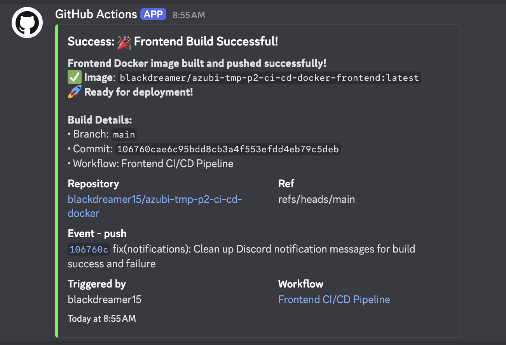
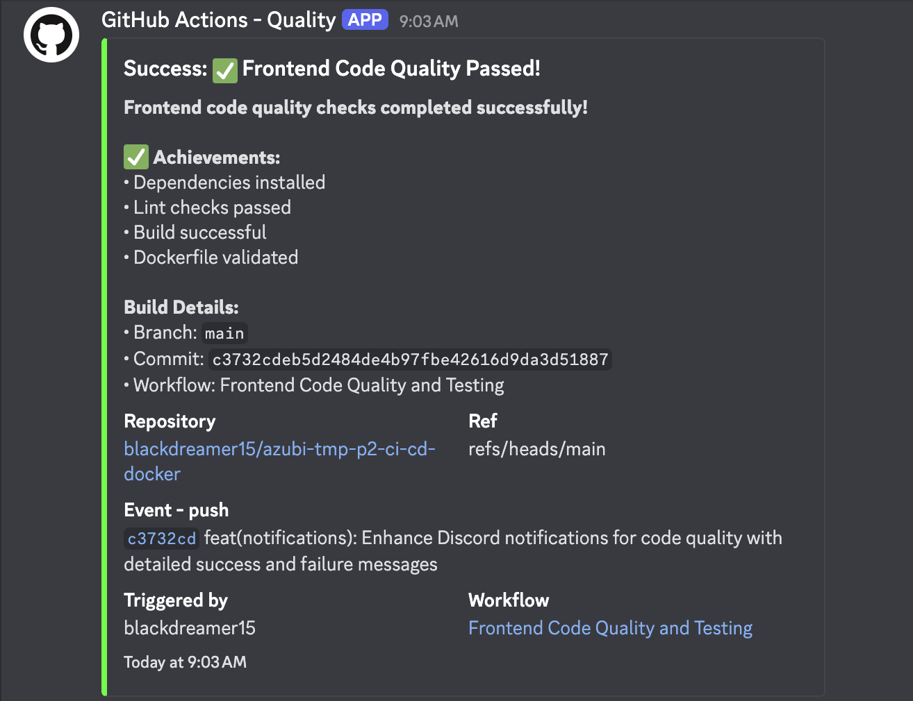
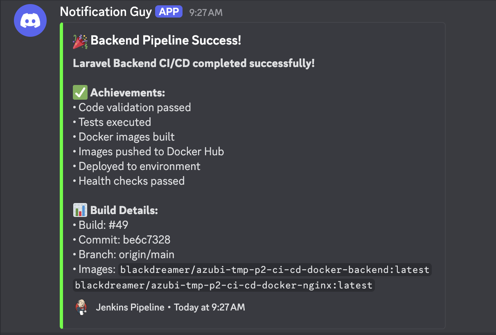

# Full-Stack Application with Docker & CI/CD

A modern full-stack application featuring a Next## � - **[🚀 JENKINS_SETUP.md](./JENKINS_SETUP.md)** - Complete Jenkins setup guide

- **[⚙️ GITHUB_ACTIONS_SETUP.md](./GITHUB_ACTIONS_SETUP.md)** - GitHub Actions configuration
- **[📡 DISCORD_NOTIFICATIONS_SETUP.md](./DISCORD_NOTIFICATIONS_SETUP.md)** - Discord webhook setup
- **[🔧 scripts/](./scripts/)** - Automation scripts documentationDocumentation

- **[� JENKINS_SETUP.md](./JENKINS_SETUP.md)** - Complete Jenkins setup guide
- **[⚙️ GITHUB_ACTIONS_SETUP.md](./GITHUB_ACTIONS_SETUP.md)** - GitHub Actions configuration
- **[� DISCORD_NOTIFICATIONS_SETUP.md](./DISCORD_NOTIFICATIONS_SETUP.md)** - Discord webhook setupontend and Laravel backend, containerized with Docker and automated with CI/CD pipelines. This project implements complete DevOps practices including containerization, automated testing, CI/CD pipelines, and deployment automation.

## 🏗️ Tech Stack

- **Frontend**: Next.js 15, React 18, Tailwind CSS
- **Backend**: Laravel 11, PHP 8.3, MySQL 8.0, Redis
- **Containerization**: Docker, Docker Compose
- **CI/CD**: GitHub Actions + Jenkins
- **Registry**: Docker Hub
- **Automation**: Bash scripts for deployment and updates

## 🚀 Quick Start

### Prerequisites

- Docker & Docker Compose
- Git
- curl, jq (for update scripts)

### 1. Clone and Setup

```bash
git clone https://github.com/blackdreamer15/azubi-tmp-p2-ci-cd-docker.git
cd azubi-tmp-p2-ci-cd-docker
./scripts/setup.sh
```

### 2. Access Services

- **Frontend**: [http://localhost:3000](http://localhost:3000)
- **Backend API**: [http://localhost:8000/api/health](http://localhost:8000/api/health)
- **Database**: MySQL on port 3306

### 3. Manage Updates

```bash
# Check for Docker Hub updates
./scripts/check-updates.sh --check

# Update all services
./scripts/check-updates.sh --update-all
```

## 📁 Project Structure

```bash
├── 📁 front-end/          # Next.js application
├── 📁 back-end/           # Laravel application  
├── 📁 scripts/            # Automation scripts
├── 📁 .github/workflows/  # GitHub Actions CI/CD
├── 📄 docker-compose.yml  # Multi-service orchestration
└── 📄 Jenkinsfile         # Jenkins pipeline
```

## 🔧 Available Scripts

### Core Scripts (in `scripts/` directory)

```bash
# Environment setup
./scripts/setup.sh

# Docker Hub update management
./scripts/check-updates.sh --help
./scripts/check-updates.sh --check
./scripts/check-updates.sh --update-all

# Backend deployment
./scripts/deploy-backend.sh deploy
```

### Docker Commands

```bash
# Start all services
docker-compose up -d

# View logs
docker-compose logs -f [service-name]

# Stop services
docker-compose down

# Database operations
docker-compose exec backend php artisan migrate
docker-compose exec backend php artisan db:seed
```

## 🌐 Service Access

| Service | URL | Credentials |
|---------|-----|-------------|
| Frontend | [http://localhost:3000](http://localhost:3000) | - |
| Backend API | [http://localhost:8000/api/health](http://localhost:8000/api/health) | - |
| Admin Login | [http://localhost:3000/login](http://localhost:3000/login) | admin/admin |
| Database | localhost:3306 | laravel_user/laravel_password |

## 📋 Documentation

- **[🔧 scripts/README.md](./scripts/README.md)** - Automation scripts documentation  
- **[⚙️ JENKINS_SETUP.md](./JENKINS_SETUP.md)** - Jenkins installation and configuration
- **[🚀 GITHUB_ACTIONS_SETUP.md](./GITHUB_ACTIONS_SETUP.md)** - GitHub Actions CI/CD setup

## 🎯 Key Features

- ✅ **Fully Containerized** - All services run in Docker containers
- ✅ **Automated CI/CD** - GitHub Actions + Jenkins pipelines
- ✅ **Production Ready** - Multi-architecture Docker images on Docker Hub
- ✅ **Auto Updates** - Docker Hub update checker and service management
- ✅ **Health Monitoring** - Service health checks and logging
- ✅ **Easy Deployment** - One-command setup and deployment
- ✅ **Discord Notifications** - Real-time pipeline status updates

## 📸 CI/CD Pipeline Notifications

Our automated pipelines send real-time Discord notifications for all build and deployment events:

### Frontend CI/CD Notifications


*GitHub Actions - Frontend Docker build and push to registry*


*GitHub Actions - Code quality checks and testing*

### Backend CI/CD Notifications


*Jenkins Pipeline - Backend build, test, and deployment*

**📋 Notification Features:**

- ✅ Build success/failure status
- ✅ Commit details and branch information
- ✅ Docker image tags and registry links
- ✅ Pipeline execution details
- ✅ Achievement summaries with health checks

## 🤝 Contributing

1. Fork the repository
2. Create a feature branch
3. Make changes and test thoroughly
4. Submit a pull request

## 📄 License

MIT License - see [LICENSE](./LICENSE) file for details.
