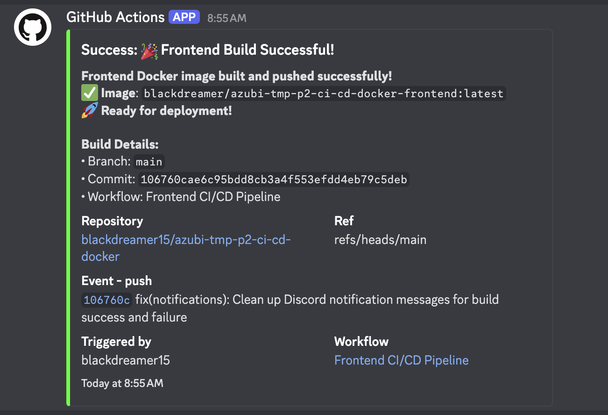
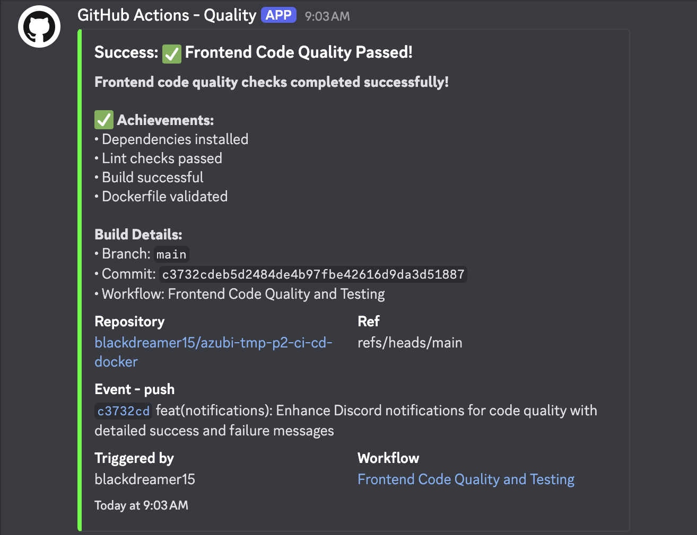
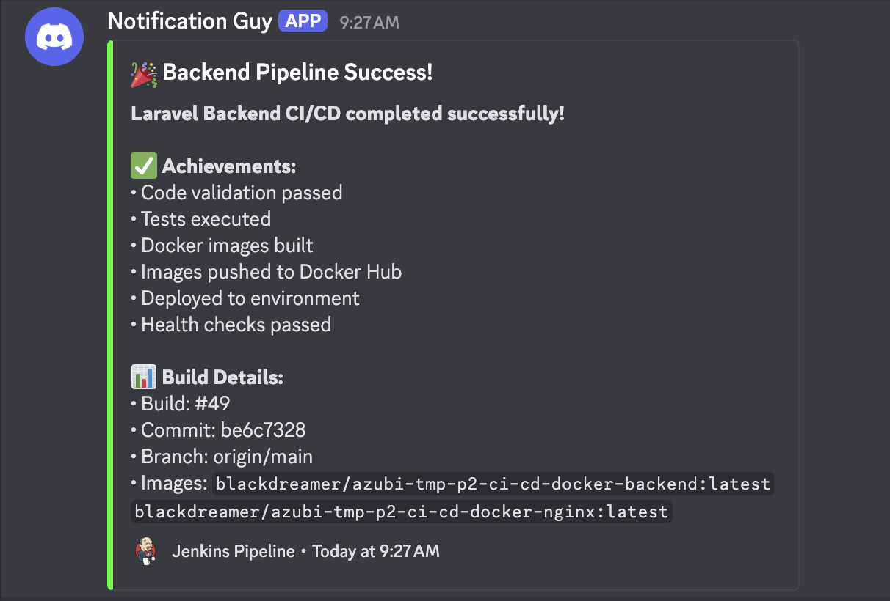

# Discord Notifications Setup Guide

This guide walks you through setting up Discord webhooks to receive real-time notifications for your CI/CD pipelines (GitHub Actions and Jenkins).

## 📋 Table of Contents

- [Prerequisites](#prerequisites)
- [Creating Discord Webhook](#creating-discord-webhook)
- [GitHub Actions Setup](#github-actions-setup)
- [Jenkins Setup](#jenkins-setup)
- [Notification Examples](#notification-examples)
- [Troubleshooting](#troubleshooting)

## 🎯 Prerequisites

- Discord server with admin permissions
- GitHub repository with Actions enabled
- Jenkins server with webhook plugins
- Basic knowledge of JSON and webhook configurations

## 🔗 Creating Discord Webhook

### Step 1: Create a Discord Channel

1. Open your Discord server
2. Create a new channel (e.g., `#ci-cd-notifications`)
3. Right-click on the channel → **Edit Channel**

### Step 2: Generate Webhook URL

1. Go to **Integrations** tab
2. Click **Create Webhook**
3. Configure webhook:
   - **Name**: `CI/CD Pipeline Bot`
   - **Avatar**: Upload a custom bot avatar (optional)
4. Copy the **Webhook URL** - you'll need this for both GitHub and Jenkins

```
Format: https://discord.com/api/webhooks/{webhook_id}/{webhook_token}
```

## 🚀 GitHub Actions Setup

### Step 1: Add Repository Secret

1. Go to your GitHub repository
2. Navigate to **Settings** → **Secrets and variables** → **Actions**
3. Click **New repository secret**
4. Create secret:
   - **Name**: `DISCORD_WEBHOOK_URL`
   - **Value**: Your Discord webhook URL

### Step 2: Update Workflow File

Add Discord notification steps to your `.github/workflows/frontend.yml`:

```yaml
name: Frontend CI/CD

on:
  push:
    branches: [ main ]
    paths: ['front-end/**']
  pull_request:
    branches: [ main ]
    paths: ['front-end/**']

jobs:
  build-and-deploy:
    runs-on: ubuntu-latest

    steps:
      # ... existing build steps ...

      - name: Notify Discord - Build Started
        if: always()
        uses: Ilshidur/action-discord@master
        env:
          DISCORD_WEBHOOK: ${{ secrets.DISCORD_WEBHOOK_URL }}
        with:
          args: |
            🚀 **Frontend Build Started**
            **Repository:** ${{ github.repository }}
            **Branch:** ${{ github.ref_name }}
            **Commit:** ${{ github.sha }}
            **Author:** ${{ github.actor }}
            **Message:** ${{ github.event.head_commit.message }}

      # ... build and test steps ...

      - name: Notify Discord - Build Success
        if: success()
        uses: Ilshidur/action-discord@master
        env:
          DISCORD_WEBHOOK: ${{ secrets.DISCORD_WEBHOOK_URL }}
        with:
          args: |
            ✅ **Frontend Build Successful**
            **Repository:** ${{ github.repository }}
            **Branch:** ${{ github.ref_name }}
            **Docker Image:** `${{ steps.meta.outputs.tags }}`
            **Build Time:** ${{ steps.build.outputs.build-time }}
            **Status:** Ready for deployment 🎉

      - name: Notify Discord - Build Failed
        if: failure()
        uses: Ilshidur/action-discord@master
        env:
          DISCORD_WEBHOOK: ${{ secrets.DISCORD_WEBHOOK_URL }}
        with:
          args: |
            ❌ **Frontend Build Failed**
            **Repository:** ${{ github.repository }}
            **Branch:** ${{ github.ref_name }}
            **Commit:** ${{ github.sha }}
            **Error:** Check the workflow logs for details
            **Action:** ${{ github.server_url }}/${{ github.repository }}/actions/runs/${{ github.run_id }}
```

### Step 3: Advanced Discord Embed (Optional)

For richer notifications with embeds:

```yaml
      - name: Discord Embed Notification
        if: always()
        uses: sarisia/actions-status-discord@v1
        with:
          webhook: ${{ secrets.DISCORD_WEBHOOK_URL }}
          title: "Frontend CI/CD Pipeline"
          description: "Build and deployment status"
          color: ${{ job.status == 'success' && '0x00ff00' || '0xff0000' }}
          fields: |
            [
              {
                "name": "Repository",
                "value": "${{ github.repository }}",
                "inline": true
              },
              {
                "name": "Branch", 
                "value": "${{ github.ref_name }}",
                "inline": true
              },
              {
                "name": "Status",
                "value": "${{ job.status }}",
                "inline": true
              },
              {
                "name": "Commit",
                "value": "[${{ github.sha }}](${{ github.server_url }}/${{ github.repository }}/commit/${{ github.sha }})",
                "inline": false
              }
            ]
```

## ⚙️ Jenkins Setup

### Step 1: Install Discord Plugin

1. Go to **Jenkins Dashboard** → **Manage Jenkins** → **Manage Plugins**
2. Search and install **Discord Notifier Plugin**
3. Restart Jenkins

### Step 2: Configure Global Discord Settings

1. Go to **Manage Jenkins** → **Configure System**
2. Find **Discord Notifier** section
3. Add your webhook URL
4. Test the connection

### Step 3: Update Jenkinsfile

Add Discord notifications to your `Jenkinsfile`:

```groovy
pipeline {
    agent any

    environment {
        DISCORD_WEBHOOK = credentials('discord-webhook-url')
    }

    stages {
        stage('Build') {
            steps {
                script {
                    // Send build start notification
                    discordSend(
                        description: "🔨 **Backend Build Started**\n**Branch:** ${env.GIT_BRANCH}\n**Build:** #${env.BUILD_NUMBER}",
                        footer: "Jenkins Pipeline",
                        link: env.BUILD_URL,
                        result: "STARTED",
                        title: "Laravel Backend CI/CD",
                        webhookURL: env.DISCORD_WEBHOOK
                    )
                }
                
                // Your build steps here
                sh 'docker build -t backend .'
            }
        }
        
        stage('Test') {
            steps {
                // Your test steps here
                sh 'docker run --rm backend php artisan test'
            }
        }
        
        stage('Deploy') {
            steps {
                // Your deployment steps here
                sh 'docker push your-registry/backend:latest'
            }
        }
    }
    
    post {
        success {
            discordSend(
                description: "✅ **Backend Pipeline Successful**\n**Branch:** ${env.GIT_BRANCH}\n**Build:** #${env.BUILD_NUMBER}\n**Docker Image:** `backend:latest`\n**Duration:** ${currentBuild.durationString}",
                footer: "Jenkins Pipeline",
                link: env.BUILD_URL,
                result: currentBuild.currentResult,
                title: "Laravel Backend CI/CD",
                webhookURL: env.DISCORD_WEBHOOK
            )
        }
        
        failure {
            discordSend(
                description: "❌ **Backend Pipeline Failed**\n**Branch:** ${env.GIT_BRANCH}\n**Build:** #${env.BUILD_NUMBER}\n**Error:** Check console logs\n**Duration:** ${currentBuild.durationString}",
                footer: "Jenkins Pipeline",
                link: env.BUILD_URL,
                result: currentBuild.currentResult,
                title: "Laravel Backend CI/CD",
                webhookURL: env.DISCORD_WEBHOOK
            )
        }
        
        always {
            echo 'Pipeline completed'
        }
    }
}
```

### Step 4: Add Jenkins Credentials

1. Go to **Manage Jenkins** → **Manage Credentials**
2. Add new **Secret text** credential:
   - **ID**: `discord-webhook-url`
   - **Secret**: Your Discord webhook URL
   - **Description**: Discord webhook for CI/CD notifications

## 📸 Notification Examples

Here are real examples of Discord notifications from our CI/CD pipelines:

### GitHub Actions Notifications

#### Frontend Build Success


*GitHub Actions - Frontend Docker build and push to registry*

#### Code Quality Checks


*GitHub Actions - Code quality checks, testing, and validation*

### Jenkins Notifications

#### Backend Pipeline Success


*Jenkins Pipeline - Backend build, test, and deployment to Docker Hub*

### Message Format Examples

#### Build Success

```text
✅ Frontend Build Successful
Repository: blackdreamer15/azubi-tmp-p2-ci-cd-docker
Branch: main
Docker Image: blackdreamer/azubi-tmp-p2-ci-cd-docker-frontend:latest
Build Time: 2m 34s
Status: Ready for deployment 🎉
```

#### Build Failure

```text
❌ Frontend Build Failed
Repository: blackdreamer15/azubi-tmp-p2-ci-cd-docker
Branch: main
Commit: abc123def456
Error: Check the workflow logs for details
Action: https://github.com/blackdreamer15/azubi-tmp-p2-ci-cd-docker/actions/runs/123456
```

### Jenkins Pipeline Examples

#### Pipeline Success

```text
✅ Backend Pipeline Successful
Branch: origin/main
Build: #42
Docker Image: backend:latest
Duration: 3 min 21 sec
```

#### Pipeline Failure

```text
❌ Backend Pipeline Failed
Branch: origin/main
Build: #43
Error: Check console logs
Duration: 1 min 45 sec
```

## 🔧 Troubleshooting

### Common Issues

#### 1. Webhook URL Not Working

- **Issue**: Discord returns 401 Unauthorized
- **Solution**: Verify webhook URL is correct and not expired
- **Check**: Regenerate webhook if needed

#### 2. GitHub Actions Secret Not Found

- **Issue**: Error: Secret DISCORD_WEBHOOK_URL not found
- **Solution**: Ensure secret is added to repository settings
- **Check**: Verify secret name matches exactly in workflow

#### 3. Jenkins Plugin Not Sending

- **Issue**: No notifications appearing in Discord
- **Solution**:
  - Check Jenkins logs for errors
  - Verify plugin is installed and enabled
  - Test webhook URL manually

#### 4. Message Formatting Issues

- **Issue**: Messages not displaying correctly
- **Solution**:
  - Use proper Markdown formatting
  - Escape special characters
  - Check Discord message limits (2000 characters)

### Testing Your Setup

#### Manual Webhook Test

```bash
curl -H "Content-Type: application/json" \
     -d '{"content":"Test message from CI/CD setup"}' \
     YOUR_DISCORD_WEBHOOK_URL
```

#### GitHub Actions Test

- Push a small change to trigger the workflow
- Check Discord channel for notifications
- Review GitHub Actions logs if notifications don't appear

#### Jenkins Test

- Trigger a manual build
- Monitor Jenkins console output
- Verify Discord channel receives notifications

## 📚 Additional Resources

- [Discord Webhooks Documentation](https://discord.com/developers/docs/resources/webhook)
- [GitHub Actions Discord Integration](https://github.com/marketplace/actions/actions-status-discord)
- [Jenkins Discord Notifier Plugin](https://plugins.jenkins.io/discord-notifier/)
- [Discord Message Formatting Guide](https://support.discord.com/hc/en-us/articles/210298617-Markdown-Text-101-Chat-Formatting-Bold-Italic-Underline-)

## 🎯 Best Practices

1. **Use Separate Channels**: Create dedicated channels for different environments (dev, staging, prod)
2. **Customize Notifications**: Tailor message content to include relevant information
3. **Rate Limiting**: Be mindful of Discord's rate limits for webhooks
4. **Security**: Never expose webhook URLs in public repositories
5. **Testing**: Always test notifications in a development environment first
6. **Monitoring**: Set up monitoring for your notification system itself

---

**📝 Note**: This setup enables real-time visibility into your CI/CD pipeline status, helping your team stay informed about build and deployment events.
