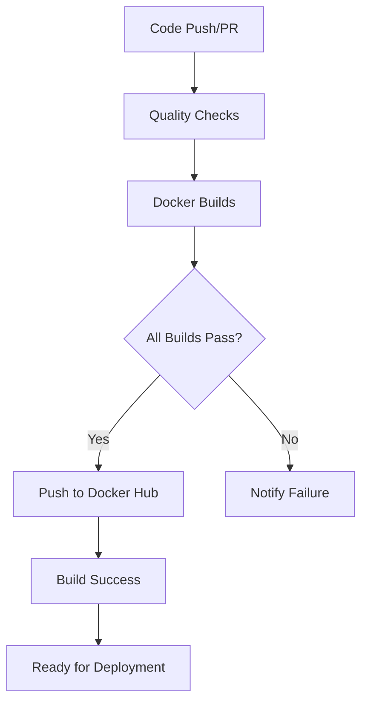

# GitHub Actions CI/CD Setup Guide

This guide explains how to configure the GitHub Actions workflows for automated Docker builds and deployments.

## 🔑 Required Secrets

To enable the CI/CD pipeline, you need to add the following secrets to your GitHub repository:

### Docker Hub Access Token

1. **Create Docker Hub Access Token:**
   - Go to [Docker Hub](https://hub.docker.com/)
   - Click on your profile → **Account Settings**
   - Go to **Security** tab
   - Click **New Access Token**
   - Name: `GitHub Actions CI/CD`
   - Permissions: `Read, Write, Delete`
   - Copy the generated token

2. **Add Secret to GitHub Repository:**
   - Go to your GitHub repository
   - Navigate to **Settings** → **Secrets and variables** → **Actions**
   - Click **New repository secret**
   - Name: `DOCKER_HUB_TOKEN`
   - Value: Paste your Docker Hub access token
   - Click **Add secret**

## 🚀 Workflows Overview

### 1. `docker-build-push.yml` - Main CI/CD Pipeline

**Triggers:**

- Push to `main` or `develop` branches
- Pull requests to `main` branch
- Manual workflow dispatch
- Only when relevant files change (frontend, backend, docker configs)

**Jobs:**

- **build-frontend**: Builds and pushes Next.js frontend image
- **build-backend**: Builds and pushes Laravel backend image
- **build-nginx**: Builds and pushes Nginx web server image
- **notify-success**: Reports successful builds
- **notify-failure**: Reports failed builds

**Features:**

- ✅ Multi-architecture builds (AMD64 + ARM64)
- ✅ Docker layer caching for faster builds
- ✅ Smart tagging (branch names, SHA, latest)
- ✅ Parallel builds for efficiency
- ✅ Build notifications

### 2. `test-quality.yml` - Code Quality & Testing

**Jobs:**

- **frontend-quality**: Node.js linting and build tests
- **backend-quality**: PHP/Laravel validation and dependency checks
- **docker-validation**: Docker Compose and Dockerfile syntax validation
- **security-scan**: Trivy vulnerability scanning

## 📋 Pipeline Flow



## 🛠️ Local Testing

Before pushing, you can test the workflows locally:

```bash
# Test Docker builds locally
docker-compose build

# Test individual services
docker build -t test-frontend -f front-end/Dockerfile front-end
docker build -t test-backend -f back-end/dockerfiles/php.dockerfile back-end
docker build -t test-nginx -f back-end/dockerfiles/nginx.dockerfile back-end

# Test Docker Compose validation
docker-compose config
```

## 🏷️ Image Tagging Strategy

Images are tagged with multiple tags for flexibility:

- `latest` - Latest build from main branch
- `main` - Main branch builds
- `develop` - Develop branch builds
- `pr-123` - Pull request builds
- `sha-abc1234` - Specific commit builds

## 🔍 Monitoring Builds

1. **GitHub Actions Tab**: View all workflow runs
2. **Docker Hub**: Check uploaded images
3. **Build Logs**: Debug any failures
4. **Notifications**: Success/failure alerts in workflow logs

## 🚨 Troubleshooting

### Common Issues:

1. **Docker Hub Authentication Failed**
   - Check `DOCKER_HUB_TOKEN` secret is correctly set
   - Ensure token has write permissions

2. **Build Timeouts**
   - Large images may timeout - optimize Dockerfiles
   - Use multi-stage builds to reduce size

3. **Dependency Issues**
   - Check package.json and composer.json for errors
   - Ensure all required files are included in build context

4. **Platform Build Failures**
   - ARM64 builds may fail for some packages
   - Remove platform constraints if needed

## 🎯 Next Steps

After setting up the secrets:

1. Commit and push your changes
2. Monitor the Actions tab for workflow execution
3. Check Docker Hub for published images
4. Test pulling and running the published images

```bash
# Test pulling the published images
docker pull blackdreamer/azubi-tmp-p2-ci-cd-docker-frontend:latest
docker pull blackdreamer/azubi-tmp-p2-ci-cd-docker-backend:latest
docker pull blackdreamer/azubi-tmp-p2-ci-cd-docker-nginx:latest
```
